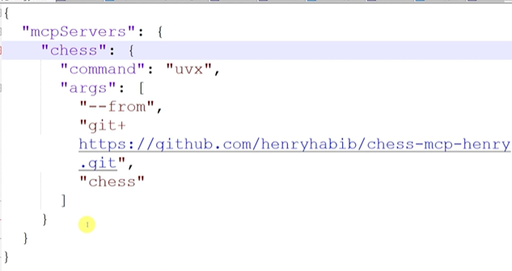

Either we can make a package for our server using package manager networks like npx or uvx or pip. ie. "npx @openbnb/mcp-server-airbnb" installs the server (stdio transport server) into our local pc and openbnb/mcp-server-airbnb is the package created using npx. Or, we can use github to deploy our server.

##### Steps while  using Github:
1. Create the folder structure for server having src folder and pyproject.toml
2. Edit pyproject.toml to instruct the build manager so that it knows what to build and how to actually deploy this
    - We've created a new object called MCP server that tells this deployment manager basically that in order to run MCP server, what they need to do is they need to go to the MCP folder and then go into the main folder and then run the main function.
    - Build system: This is necessary to basically run the required setup tools.
    - Tell build manager that our package is in src folder.
3. Check: to start or build the server: cd into deployment folder-> uv run mcp-server
4. Check in claude also (Instead of chess, write 'mcp-server'):

5. Package it up and Put this into a public github repo.
6. Now, anywhere locally, run (here we used uvx instead of just uv as its installing all the packages too from the github):
    ```
    uvx --from git+https://github.com/hernyhabib/mcpserver.git mcp-server
    ```
    So basically what this command will do is that it will download all the code in this GitHub repo. It will then install and build all the necessary projects and dependencies in that codebase. And then it will run a script called mcp-server which will run this file here, which will run the main function of the main script in the MCP folder, which will then run the server.
7. Now, open claude config.json and paste the config file and check if the tools are available which means it has successfully installed the server. It will first it will download everything from this GitHub repo. It will then install the server and then run it, and then you will have access to that server on your local machine, or on your local client.

Note: Your local computer should have uv installed.

# Installation Steps

To install the `add_tool` MCP server, run the following command:

```json
{
  "mcpServers": {
    "add_tool": {
      "command": "uvx",
      "args": [
        "--from",
        "git+https://github.com/henryhabib/mcpserverexample.git",
        "mcp-server"
      ]
    }
  }
}
```

This will fetch and set up the `mcp-server` from the specified GitHub repository.
